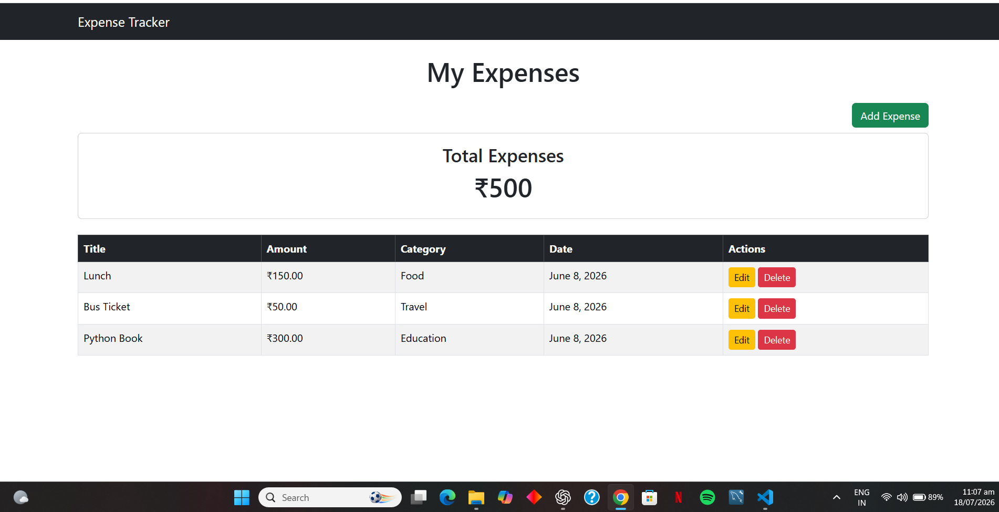
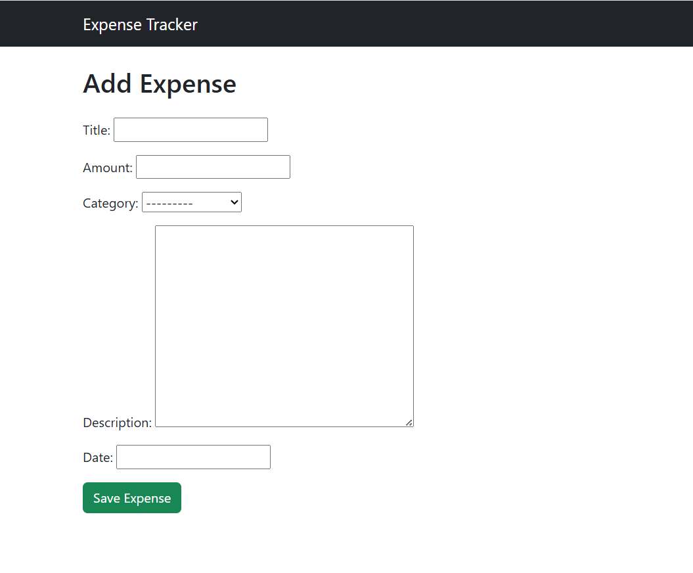
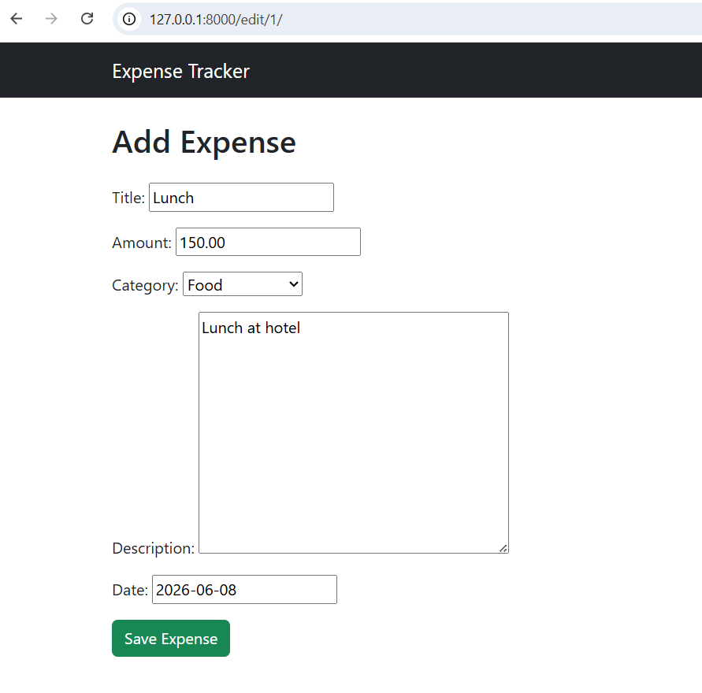
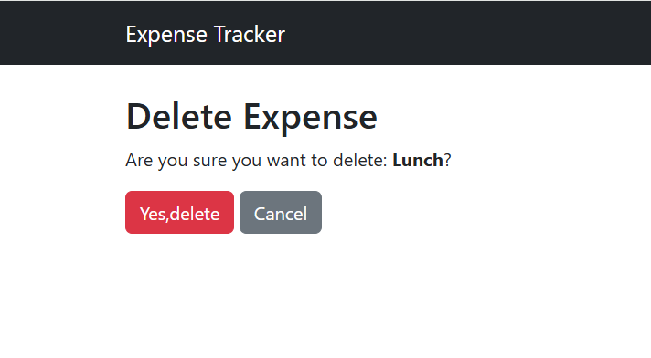

# Expense Tracker

A web-based Expense Tracker application built using Django that helps users efficiently manage and track their daily expenses.

## Features
- Add new expenses
- View expense records
- Update existing expenses
- Delete expenses
- User-friendly interface
- Database integration using SQLite

## Technologies Used
- Python
- Django
- HTML5
- CSS3
- Bootstrap
- SQLite

## Project Structure
- ET/ – Django project configuration
- expenses/ – Expense management application
- manage.py – Django management script

## 📸 Screenshots

### Home Page

### Add Expense

### Edit Expense

### Delete Confirmation

## Author
**Keerthana Narayanan**

GitHub: https://github.com/keerthana7326
